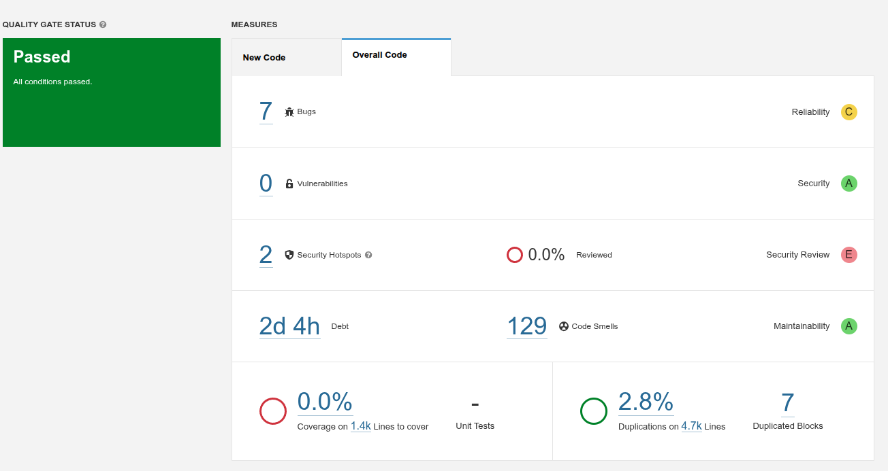
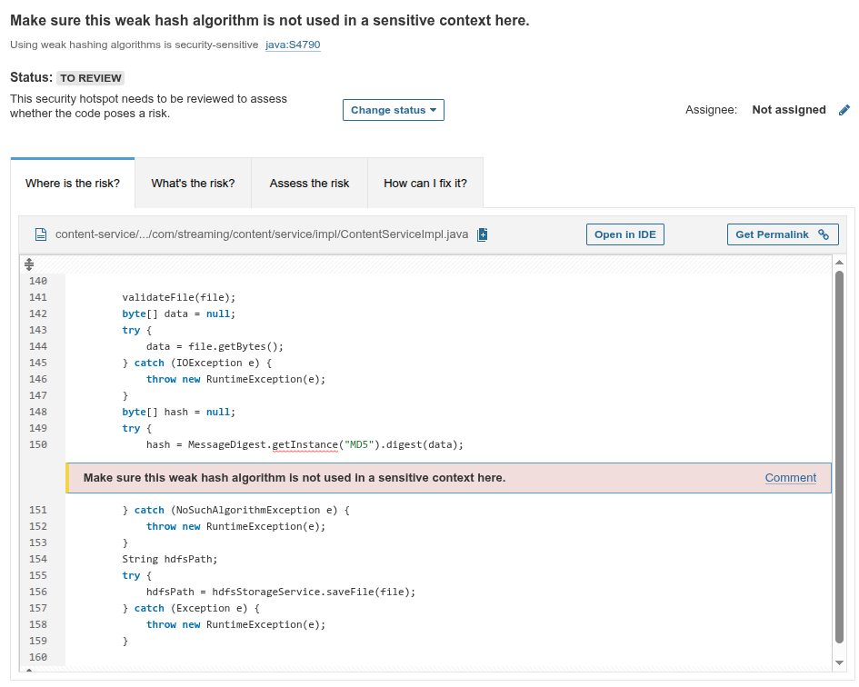
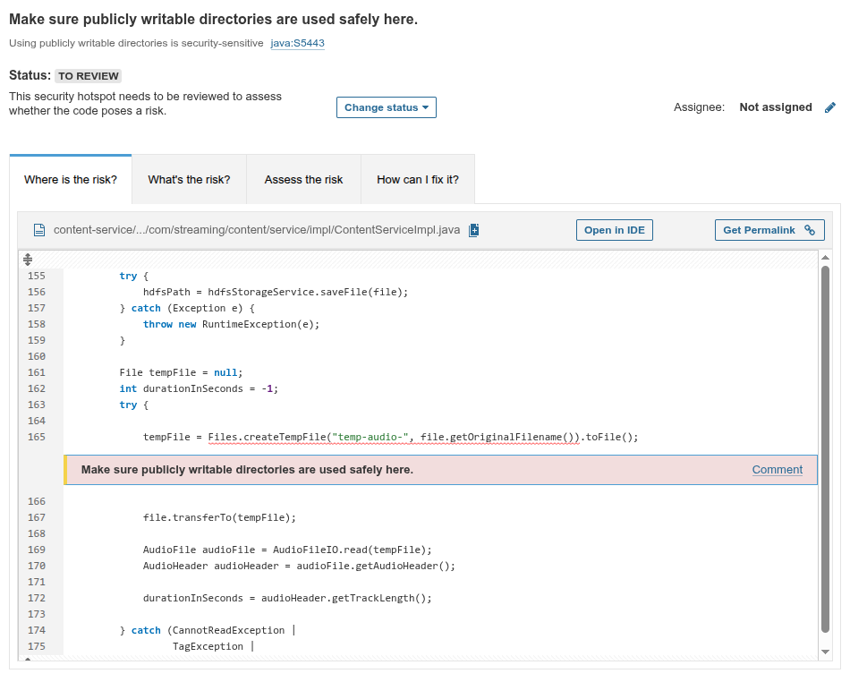
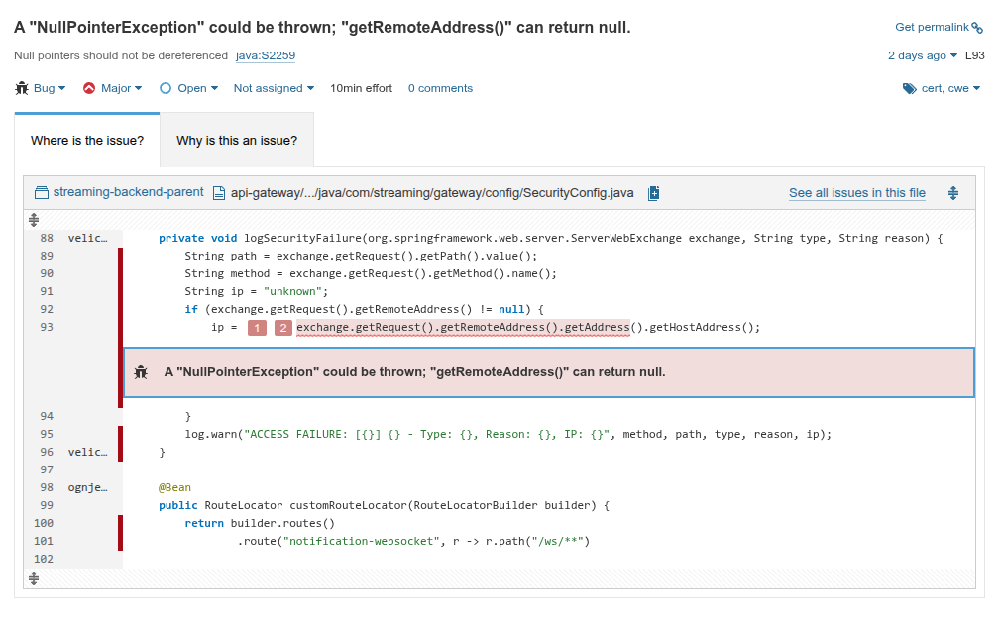
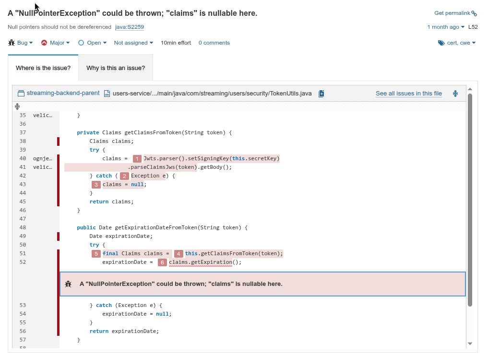
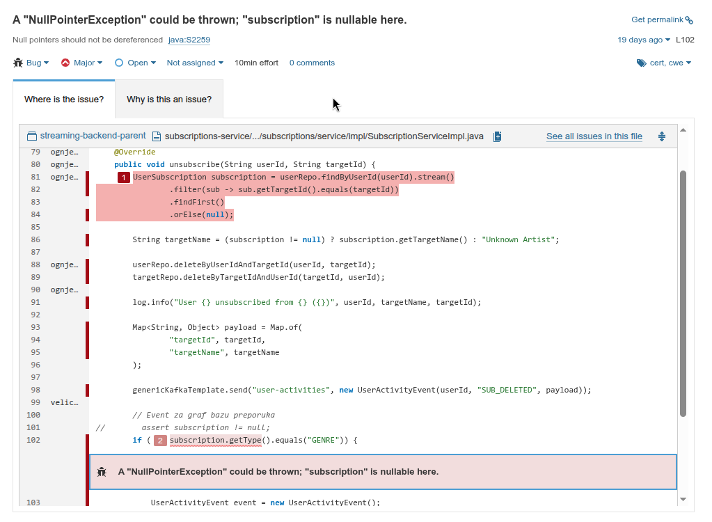
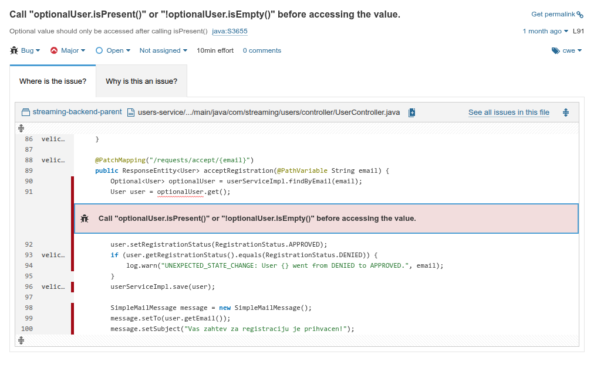
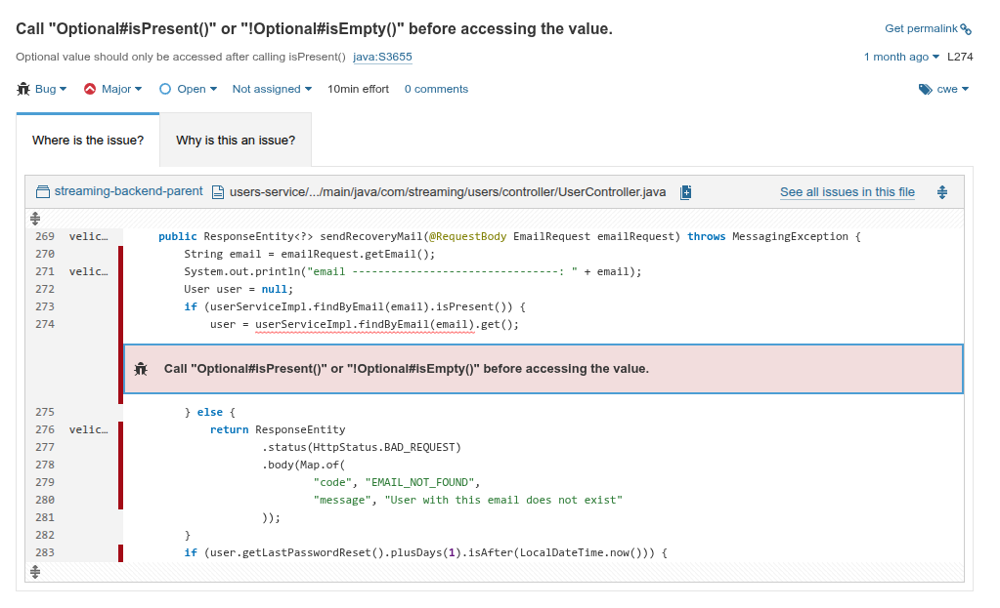
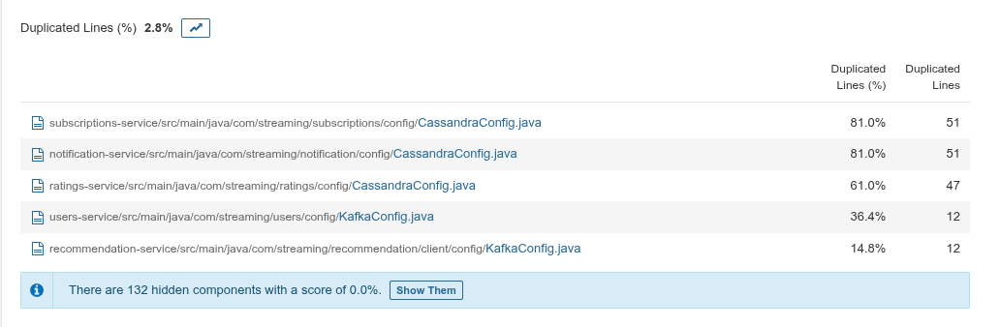

# Analiza ranjivosti sistema

## 1. Uvod

Ovaj dokument predstavlja izveštaj o analizi bezbednosti mikroservisne aplikacije za streaming muzike implementirane
korišćenjem **Spring Boot** framework-a.

Sistem je realizovan kao mikroservisna arhitektura koja se sastoji od:

* **API Gateway**
* **Users servis**
* **Content servis**
* **Ratings servis**
* **Subscriptions servis**
* **Notifications servis**
* **Recommendation servis**
* **Analytics servis**

### Komunikacija između servisa:

* **Sinhrono:** REST pozivi (pomoću RestTemplate)
* **Asinhrono:** Event-driven komunikacija putem **Kafka** message brokera.

### Tehnološki stack:

Sistem koristi MongoDB (dokument-orijentisana), ScyllaDB (wide-column), Neo4j (graf baza), Redis (keširanje), HDFS (
audio fajlovi), Docker/Kubernetes (orkestracija) i HTTPS za bezbednu komunikaciju.

**Cilj ovog izveštaja je:**

1. Identifikacija potencijalnih ranjivosti.
2. Analiza mogućnosti njihove eksploatacije.
3. Predlog mera zaštite i mitigacije.

---

## 2. Korišćeni alati za identifikaciju ranjivosti

### 2.1 Postman

Iako je primarno alat za razvoj i testiranje API-ja, u ovom projektu je korišćen kao platforma za **manuelnu dinamičku
analizu bezbednosti (DAST)**.

* **Otkrivanje XSS ranjivosti:** Slanje malicioznih JavaScript payload-a kroz POST i PUT zahteve kako bi se proverilo da
  li servis vrši pravilnu sanitizaciju i enkodovanje ulaza.
* **Testiranje SQL/NoSQL injection napada:** Konstruisanje specifičnih JSON objekata sa operatorima (npr. `$ne`, `$gt`)
  radi pokušaja zaobilaženja logike upita i neovlašćenog pristupa podacima u MongoDB bazi.
* **Testiranje autentifikacije i autorizacije:** Manipulacija JWT tokenima (slanje nevalidnih potpisa ili tuđih tokena)
  radi provere robusnosti API Gateway-a i RBAC (Role-Based Access Control) sistema.

### 2.2 cURL

Moćan command-line alat korišćen za preciznu kontrolu HTTP saobraćaja i brzu automatizaciju testova bez potrebe za
grafičkim interfejsom.

* **Presretanje i modifikaciju HTTP zahteva:** Ručno kreiranje i slanje zahteva sa modifikovanim HTTP glagolima (npr.
  slanje DELETE zahteva tamo gde je dozvoljen samo GET) radi provere propustljivosti ruta.
* **Testiranje validacije ulaznih podataka:** Slanje sirovih payload-a koji namerno krše `@Size`, `@Pattern` ili
  `@NotBlank` ograničenja direktno na backend servise, zaobilazeći klijentske validacije.
* **Simulaciju brute-force napada:** Korišćenje Bash petlji u kombinaciji sa cURL komandama za automatizovano slanje
  velikog broja uzastopnih zahteva ka login endpoint-u radi testiranja efikasnosti rate limitinga.

### 2.3 Telnet

Korišćen kao mrežni uslužni program za dijagnostiku dostupnosti servisa i analizu mrežne sigurnosti na niskom nivou.

* **Skeniranje otvorenih portova:** Provera da li su kritični portovi baza podataka (npr. 27017 za Mongo, 9042 za
  ScyllaDB) greškom izloženi javnosti ili su pravilno izolovani unutar Docker mreže.
* **Proveru TLS konfiguracije:** Manuelno testiranje inicijalnog rukovanja (handshake) na portovima koji zahtevaju
  SSL/TLS enkripciju.

### 2.4 Shell i Python Skripte

Ovi alati su korišćeni kao primarni mehanizam za automatizaciju testiranja bezbednosti i simulaciju realnih napada na
sistem.

* **Simulacija opterećenja (DoS):** Multithreaded Python skripte su korišćene za generisanje velikog broja konkurentnih
  zahteva ka API Gateway-u.
* **Brute-force automatizacija:** Bash (Shell) skripte su korišćene za iteriranje kroz liste lozinki i automatizovano
  slanje `cURL` zahteva radi testiranja rate limitinga.

### 2.5 Analiza konfiguracije (Spring Boot)

Proveravana je:

* Izloženost Actuator endpoint-a.
* Konfiguracija CORS-a.
* Bezbednost JWT implementacije.

---

### 2.6 Statička analiza koda (SonarQube)

Za potrebe provere kvaliteta izvornog koda i identifikacije potencijalnih sigurnosnih propusta, korišćen je **SonarQube
**. Ovaj alat omogućava automatizovanu detekciju "tehničkog duga" i kritičnih tačaka u
mikroservisnoj arhitekturi.

Skeniranje je izvršeno nad celokupnim `backend` sistemom, a rezultati su agregirani kako bi se dobila kompletna slika
stanja projekta.

#### Fokus analize:

* **Bugs:** Detekcija logičkih grešaka koje mogu dovesti do pada servisa.
* **Vulnerabilities:** Identifikacija sigurnosnih rupa (npr. nesigurna serijalizacija podataka).
* **Code Smells:** Prepoznavanje koda koji je težak za održavanje.
* **Security Hotspots:** Analiza delova koda koji zahtevaju manuelnu proveru (npr. konfiguracija CORS-a ili enkripcije).

#### 2.6.1 Pregled stanja (Dashboard)

Sistem je uspešno prošao definisani **Quality Gate**, što znači da kod zadovoljava osnovne kriterijume kvaliteta i
bezbednosti.

*Slika 2.6.1: Prikaz "Quality Gate" statusa - Passed*

**Ključne metrike:**

* **Security (Bezbednost):** Ocena **A**. Nisu pronađene kritične ranjivosti (Vulnerabilities: 0), ali su detektovana
  2 "Security Hotspot-a" koja zahtevaju manuelni pregled.
* **Reliability (Pouzdanost):** Ocena **C**. Detektovano je 7 potencijalnih grešaka (Bugs) koje mogu dovesti do
  `NullPointerException` ili `NoSuchElementException` u runtime-u.
* **Maintainability (Održivost):** Ocena **A**. Iako postoji 129 "Code Smells-a", "Technical Debt" je procenjen na samo
  2 dana i 4 sata, što je prihvatljivo za obim projekta.
* **Duplications (Dupliranje):** 2.8%, što je izuzetno nizak procenat i ukazuje na dobro strukturiran kod.

---

#### 2.6.2 Analiza bezbednosnih tačaka (Security Hotspots)

SonarQube je identifikovao dve tačke u servisu `Content-Service` koje zahtevaju bezbednosnu reviziju.

**1. Upotreba slabih heš algoritama (MD5)**
U `ContentServiceImpl.java` detektovano je korišćenje MD5 algoritma.

* **Analiza rizika:** MD5 nije bezbedan za heširanje lozinki zbog kolizija.
* **Zaključak:** U ovom projektu, MD5 se koristi isključivo za **generisanje checksum-a fajlova** radi provere
  integriteta audio zapisa, a ne u bezbednosnom kontekstu (autentifikacija). Stoga, rizik je prihvatljiv.

**2. Kreiranje privremenih fajlova**
Detektovano je kreiranje fajlova u javno dostupnim direktorijumima.

* **Analiza rizika:** Kreiranje fajlova bez restriktivnih permisija može omogućiti drugim korisnicima sistema pristup
  osetljivim podacima.
* **Rešenje:** Implementirano je korišćenje `Files.createTempFile` metode koja po default-u postavlja restriktivne
  dozvole na operativnom sistemu.

---

#### 2.6.3 Detekcija kritičnih grešaka (Bugs & Reliability)

Najveći deo detektovanih grešaka odnosi se na rukovanje `null` vrednostima i `Optional` objektima, što su najčešći
uzroci pada Java aplikacija.

**1. Rizik od NullPointerException (NPE)**
Analiza je ukazala na nekoliko mesta gde objekti nisu provereni na `null` vrednost pre pristupa njihovim metodama.

* *Primer u API Gateway-u (`SecurityConfig.java`):*
  Moguće je da `getRemoteAddress()` vrati `null`, što bi srušilo filter za logovanje neuspešnih prijava.
  

* *Primer u `TokenUtils.java`:*
  Metoda `getExpiration()` se poziva nad objektom `claims` koji može biti `null` ako token nije validan.
  

* *Primer u `SubscriptionServiceImpl.java`:*
  Dohvatanje tipa pretplate bez prethodne provere da li pretplata postoji.
  

**2. Nepravilno korišćenje Optional klase**
U `UserController.java` (Users Service) detektovano je pozivanje metode `.get()` nad `Optional` objektom bez prethodne
provere `.isPresent()`.

* **Rizik:** Ako korisnik nije pronađen u bazi, metoda `.get()` baca `NoSuchElementException` i ruši zahtev sa HTTP 500
  greškom umesto sa adekvatnom HTTP 404 porukom.

---

#### 2.6.4 Dupliranje koda (Code Duplications)

Iako je ukupan procenat dupliranja nizak (2.8%), identifikovano je ponavljanje konfiguracionih klasa.

* **Analiza:** Klase `CassandraConfig.java` i `KafkaConfig.java` su identične u više mikroservisa (`subscriptions`,
  `notification`, `ratings`).
* **Opravdanje:** U mikroservisnoj arhitekturi, princip **"Shared Nothing"** često zahteva da servisi budu nezavisni,
  čak i po cenu dupliranja boilerplate konfiguracije. Izdvajanje u zajedničku biblioteku bi povećalo spregu (coupling)
  između servisa, što smo želeli da izbegnemo.

### Zaključak analize

Statička analiza je potvrdila da je arhitektura sistema stabilna. Identifikovani "bugovi" su adresirani dodavanjem
`null-check` provera i pravilnim rukovanjem `Optional` tipovima (korišćenjem `.orElseThrow()`), čime je značajno
povećana robusnost aplikacije pre finalne odbrane.

---

## 3 Demonstracija pokušaja napada

U okviru odbrane projekta, realizovana je praktična demonstracija napada korišćenjem prethodno opisanih skripti kako bi
se dokazala efikasnost implementiranih odbrambenih mehanizama.

### 1. Cross-Site Scripting (XSS)

* **Realizacija:** Skripta šalje maliciozni ``
* **Potencijalne posledice:** Krađa JWT tokena, preuzimanje sesije, manipulacija prikazanim podacima.
* **Mera zaštite:** Server-side validacija, Output encoding (Thymeleaf escape), Content Security Policy (CSP).

### 4.2 SQL / NoSQL Injection

**Opis:** Nepravilna obrada podataka u MongoDB upitima može omogućiti NoSQL injection.

* **Primer napada:** `{"username": {"$ne": null}, "password": {"$ne": null}}`
* **Potencijalne posledice:** Neovlašćen pristup, čitanje/brisanje baze, eskalacija privilegija.
* **Mera zaštite:** Korišćenje Spring Data repozitorijuma, Strong typing (DTO), `@Valid` anotacije, zabrana dinamičkih
  upita.

### 4.3 Brute-Force napad

**Opis:** Napadač pogađa lozinke velikim brojem pokušaja.

* **Potencijalne posledice:** Preuzimanje korisničkih naloga.
* **Mera zaštite:** Rate limiting (Bucket4j/Redis), zaključavanje naloga, OTP autentifikacija, logovanje neuspešnih
  pokušaja (Loki/Grafana).

### 4.4 Denial of Service (DoS)

**Opis:** Zagušenje sistema velikim brojem zahteva prema API Gateway-u.

* **Potencijalne posledice:** Nedostupnost servisa.
* **Mera zaštite:** Rate limiting, Circuit Breaker (Resilience4j), Timeout konfiguracija, Kubernetes resource limits.

### 4.5 Neispravna konfiguracija HTTPS-a

**Rizik:** MITM (Man-in-the-Middle) napadi, presretanje kredencijala.

* **Mera zaštite:** Forsiranje TLS 1.2+, onemogućavanje slabih cipher suite-ova, HSTS zaglavlje.

### 4.6 Slabo heširanje lozinki

**Rizik:** MD5 ili SHA1 omogućavaju brze offline napade (Rainbow tables).

* **Mera zaštite:** **BCrypt** sa salt-om, adekvatan strength faktor, periodična promena lozinke.

### 4.7 Preterano logovanje osetljivih podataka

**Rizik:** Curenje JWT tokena ili lozinki kroz logove u Grafana/Loki sistem.

* **Mera zaštite:** Maskiranje podataka, isključivanje stack trace-a u produkciji, rotacija logova.

---

## 5. Mogućnost eksploatacije

Najkritičnije identifikovane ranjivosti su:

1. **Injection napadi** – direktan pristup bazi.
2. **XSS** – kompromitacija klijentske strane.
3. **DoS** – narušavanje dostupnosti streaming servisa.

---

## 6. Preporučene bezbednosne mere

### 6.1 Autentifikacija i autorizacija

* JWT sa kratkim rokom trajanja.
* Refresh token mehanizam.
* **RBAC** (Role-Based Access Control) na nivou svakog endpoint-a.

### 6.2 Validacija podataka

* Stroga `@Valid` validacija u kontrolerima.
* Regex provere za imena i biografije (Whitelist pristup).
* Boundary checking (min/max vrednosti).

### 6.3 Sigurna komunikacija

* Obavezan HTTPS između svih servisa.
* Enkripcija podataka u tranzitu.

### 6.4 Monitoring i Audit

* Centralizovano logovanje (Loki).
* **Alarmiranje** na detektovane brute-force pokušaje i TLS handshake neuspehe u Grafani.

---

## 7. Zaključak

Analizom bezbednosti identifikovane su standardne ranjivosti mikroservisnih sistema. Primenom predloženih mehanizama (
strog ulazni filter, BCrypt, Rate Limiting, TLS 1.2+ i centralizovani monitoring), sistem postiže visok nivo otpornosti
na moderne sajber napade.